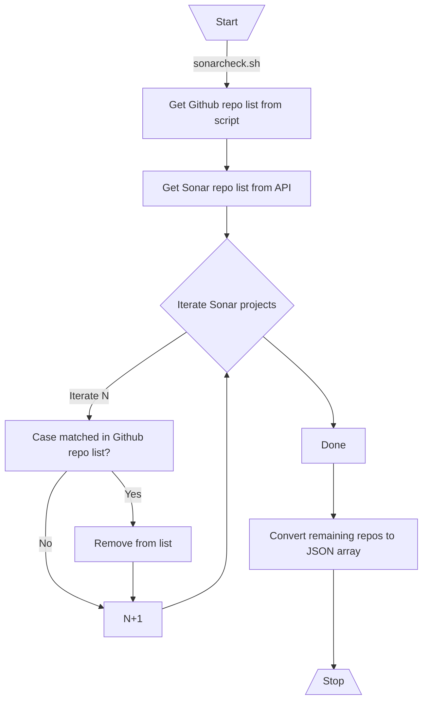

# StatusTracker

Sonar cleanup workflow:

```mermaid
flowchart TD

A[\Start/] --> |sonarcheck.sh| B[Get Github repo list from script]

B --> C[Get Sonar repo list from API]

C --> D{Iterate Sonar projects}

D --> |Iterate N| E[Case matched in Github repo list?]

E --> |No| J[N+1]

E --> |Yes| F[Remove from list] --> J

J --> D


D --> Done --> G[Convert remaining repos to JSON array]

G ---> H[/Stop\]


```